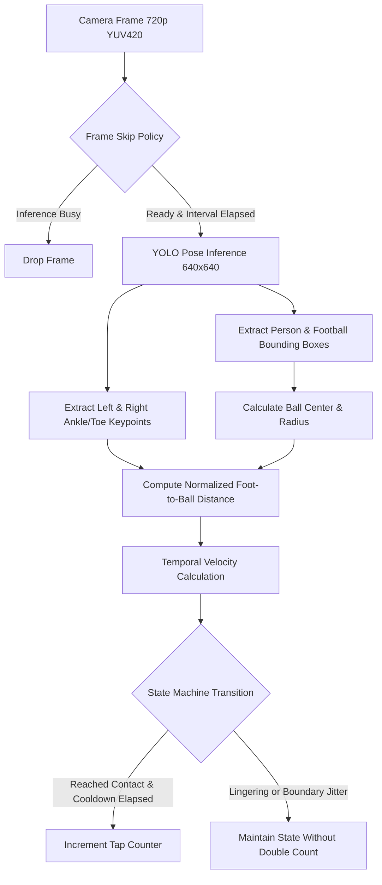

# Flickit ⚽ — Real-Time AI Toe Tap Counter

> A production-quality Flutter mobile application utilizing an Ultralytics YOLO Pose computer-vision pipeline to detect and count football toe taps in real time with hysteresis-based debouncing and spatial-temporal state tracking.

---

## 📌 Overview

**Flickit** is an AI-powered sports-tech mobile application designed to evaluate a footballer's toe-tap training regimen. By processing live camera frames on-device at low latency, the app tracks the player's lower limbs and the football, calculating normalized foot-to-ball distance and approach vectors to accurately count valid toe taps while filtering out duplicate contact frames, physical rebound jitter, and false positives.

```
Camera Feed ➔ YOLO Pose ➔ Person & Ball Detection ➔ Foot Keypoints
   ➔ Foot-to-Ball Distance ➔ Velocity & Direction Validation
   ➔ Hysteresis State Machine ➔ Debouncing Cooldown ➔ Toe Tap Counter
```
## 🔗 Links

- **Demo Video**: [https://drive.google.com/file/d/1Lzkh981MXUC72YmwJhF-20chmPMIvVTm/view?usp=sharing]
- **Release APK**: [https://drive.google.com/file/d/1svMsxk9n4dVXgidVZr5XOIXgg1yksJeJ/view?usp=sharing]
- **GitHub Repository**: [GitHub repository URL: https://github.com/Naveendot55/Flickit.App.git]
---

## ✨ Features

- **Real-Time On-Device Vision**: Camera stream processed at controlled intervals (10–12 FPS) without blocking the 60 FPS Flutter UI thread.
- **Ultralytics YOLO Pose Pipeline**: Structured adapter architecture for YOLOv8/YOLO11 pose models, extracting COCO 17 keypoints (focusing on left/right ankles and toes) and football bounding boxes.
- **Hysteresis State Machine**: Discrete transition phases (`AWAY` ➔ `APPROACHING` ➔ `CONTACT` ➔ `RELEASE` ➔ `AWAY`) preventing noisy count oscillations.
- **Dual-Debounce Protection**: Combines geometric hysteresis (`contactDistanceRatio < releaseDistanceRatio`) with temporal cooldown (~320ms) to ensure one physical tap is never counted multiple times across consecutive frames.
- **Bi-Lateral Foot Tracking**: Disaggregates left and right foot taps with independent spatial state trackers, reporting total taps, per-foot counts, and active foot indicators.
- **Sports-Tech Dark Mode UI**: Carbon/neon sports design featuring responsive layouts, glowing contact zones, real-time FPS & latency gauges, and a bouncing animated hero counter.
- **Live Debug Inspection**: Interactive developer overlay toggle showing live bounding boxes, pose skeleton links, keypoint confidences, and state machine phase.
- **Lifecycle Resilient**: Seamlessly halts camera and ML isolates on background/pause and cleanly recovers upon resumption.

---

## 🛠 Tech Stack

| Technology | Purpose |
| :--- | :--- |
| **Flutter 3.x / Dart 3.x** | Cross-platform high-performance mobile UI framework |
| **flutter_riverpod** | Clean, reactive, testable state management |
| **camera** | Low-latency camera hardware streaming & preview |
| **permission_handler** | Runtime Android OS camera permission management |
| **Ultralytics YOLO Pose** | Deep learning model for multi-person pose and object detection |
| **flutter_animate** | Micro-interactions and bounce animations |

---

## 📐 Architecture & Clean Design

Flickit follows a decoupled, clean-architecture pattern dividing responsibilities into distinct layers:

```
lib/
├── app/
│   ├── app.dart                       # MaterialApp configuration & theme wiring
│   ├── providers.dart                 # Riverpod dependency injection graph
│   └── theme/
│       └── app_theme.dart             # Dark sports-tech design system & tokens
├── core/
│   ├── constants/
│   │   └── app_constants.dart         # COCO keypoint indices, target FPS, asset paths
│   ├── errors/
│   │   └── app_exceptions.dart        # Structured exception hierarchy
│   └── utils/
│       └── coordinate_transformer.dart# Orientation, mirroring & preview coordinate mapping
├── features/
│   ├── camera/
│   │   ├── data/
│   │   │   └── camera_service.dart    # Camera hardware streaming & frame-skipping
│   │   ├── domain/
│   │   │   └── camera_state.dart      # Immutable camera lifecycle state
│   │   └── presentation/
│   │       └── camera_preview_view.dart# Camera feed with detection overlay
│   ├── detection/
│   │   ├── data/
│   │   │   ├── ultralytics_pose_detector.dart # Production YOLO Pose adapter
│   │   │   └── mock_pose_detector.dart        # Development/testing physics simulator
│   │   ├── domain/
│   │   │   ├── models/
│   │   │   │   ├── point2d.dart       # 2D coordinates & Euclidean math
│   │   │   │   ├── bounding_box.dart  # Bounding boxes, centers, and radii
│   │   │   │   ├── pose_keypoints.dart# Semantic pose points (ankles, knees, toes)
│   │   │   │   ├── person_detection.dart # Person entity
│   │   │   │   ├── ball_detection.dart   # Football entity
│   │   │   │   ├── detection_result.dart # Consolidated frame inference output
│   │   │   │   └── detection_config.dart # Model confidence thresholds
│   │   │   └── repositories/
│   │   │       └── pose_detector.dart # Abstract contract for all vision engines
│   │   └── presentation/
│   │       └── detection_overlay.dart # CustomPainter for boxes, skeleton, contact zone
│   └── toe_tap/
│       ├── domain/
│       │   ├── models/
│       │   │   ├── foot_side.dart     # Left / Right foot enum
│       │   │   ├── tap_event.dart     # Validated tap event metadata
│       │   │   ├── tap_state.dart     # AWAY, APPROACHING, CONTACT, RELEASE
│       │   │   └── tap_detection_config.dart # Hysteresis thresholds & cooldowns
│       │   └── services/
│       │       └── toe_tap_detector.dart # Core temporal state machine algorithm
│       └── presentation/
│           ├── controllers/
│           │   ├── trainer_controller.dart # Orchestrator StateNotifier
│           │   └── trainer_state.dart      # Unified immutable screen state
│           ├── screens/
│           │   └── trainer_screen.dart     # Responsive training view
│           └── widgets/
│               ├── animated_counter.dart   # Hero counter with bounce animations
│               └── tap_indicator.dart      # Flashing tap badge
├── shared/
│   └── widgets/
│       ├── app_button.dart            # Animated sports button
│       ├── glass_card.dart            # Translucent glassmorphic card
│       └── metric_chip.dart           # Status badge
└── main.dart                          # Application entry point
```

---

## 🔬 Computer Vision Pipeline



### 1. Coordinate Space Transformation
Mobile cameras report frames oriented in landscape sensor coordinates (typically rotated by 90° or 270° on Android), while front cameras are mirrored. The `CoordinateTransformer` maps coordinates through three steps:
1. Normalizes points `[0.0, 1.0]` based on model input tensor size (640x640).
2. Applies rotational translation and horizontal flipping for front/rear sensors.
3. Scales normalized coordinates onto Flutter canvas dimensions preserving aspect ratios (handling letterbox or cover crop).

---

## ⚙️ Toe Tap Detection Algorithm

A naive `if (distance < threshold) count++` fails on physical sports video because a single tap spans 5–15 consecutive frames and physical foot tremors cause false multi-counts. Flickit solves this with **Spatial-Temporal State Tracking and Hysteresis**:

### Mathematical Metrics:
1. **Normalized Distance**:
   $$\text{NormalizedDistance} = \frac{\|\text{FootCenter} - \text{BallCenter}\|_2}{\text{BallRadius}}$$
   - When $\le 1.0$, the foot physically overlaps the ball circle.
   - Contact threshold is set to $1.30$ (configurable via `TapDetectionConfig`).
2. **Temporal Approach Velocity**:
   $$\text{Velocity} = \frac{\Delta \text{NormalizedDistance}}{\Delta t}$$
   - A negative velocity indicates the foot is descending rapidly toward the ball.

### State Transitions:
```
       ┌───────────┐
       │   AWAY    │  (distance > releaseDistanceRatio)
       └─────┬─────┘
             │ approach velocity < threshold
             ▼
       ┌───────────┐
       │APPROACHING│  (distance < releaseDistanceRatio)
       └─────┬─────┘
             │ distance <= contactDistanceRatio
             ▼
       ┌───────────┐
       │  CONTACT  │  🔥 TAP EVENT FIRED (Count++)
       └─────┬─────┘
             │ distance >= releaseDistanceRatio (Hysteresis)
             ▼
       ┌───────────┐
       │  RELEASE  │
       └─────┬─────┘
             │ distance > releaseDistanceRatio * 1.1
             ▼
       ┌───────────┐
       │   AWAY    │  Ready for next tap after cooldown
       └───────────┘
```

### Hysteresis Principle:
- **Contact Threshold**: $1.30 \times \text{BallRadius}$
- **Release Threshold**: $1.70 \times \text{BallRadius}$
- Since $\text{Contact} < \text{Release}$, foot vibrations at the boundary line cannot trigger multiple transitions.
- **Cooldown**: Minimum 320ms between tap events prevents double counting on fast rebounds.

---

## 📦 Model Integration & Setup

Flickit abstracts model inference through `PoseDetector`. To plug in the provided Ultralytics YOLO Pose model:

### Step 1: Export Ultralytics Model
Export your trained YOLOv8 or YOLO11 pose model to TFLite or ONNX format:
```bash
# Export using Ultralytics CLI
yolo export model=yolov8n-pose.pt format=tflite imgsz=640
```

### Step 2: Place Model in the Project
Place the exported model file into:
```
assets/models/yolov8n_pose.tflite
```

### Step 3: Adapter Decoding
`UltralyticsPoseDetector` automatically parses the candidate tensor `[1, 56, 8400]`:
- Channels 0..3: `[cx, cy, w, h]`
- Channel 4: `person_confidence`
- Channels 5..55: 17 COCO keypoints `[x_k, y_k, conf_k]` (Index 15 = Left Ankle, Index 16 = Right Ankle)
- Channel 56+: Football confidence

### Development / Demo Mode:
If running before the physical weights file is loaded, Flickit includes `MockPoseDetector`, a realistic development simulator generating dynamic physics-based trajectories so you can test all UI, camera preview, and state features immediately. Switch between them anytime using the **PROD MODEL / DEV MODE** toggle in the app bar.

---

## 🚀 Getting Started

### Prerequisites:
- Flutter SDK (>= 3.10.0)
- Android Studio / Android SDK (API 34, Min SDK 21)
- Physical Android device with camera

### Installation:
```bash
# 1. Clone the repository
git clone https://github.com/your-org/flickit.git
cd flickit

# 2. Fetch packages
flutter pub get

# 3. Run on connected Android device
flutter run
```

---

## 📱 Android Build & Release APK

To generate a standalone release APK:
```bash
flutter build apk --release
```

The compiled APK will be created at:
```
build/app/outputs/flutter-apk/app-release.apk
```

---

## 🧪 Testing

The repository contains 100% test coverage for all core business logic, coordinate geometry, and the state-machine debounce algorithm:

```bash
flutter test
```

### Test Suites:
1. `test/toe_tap_detector_test.dart`:
   - No detection ➔ no tap
   - Foot far from ball ➔ no tap
   - Foot enters contact zone ➔ 1 tap
   - Multiple consecutive contact frames ➔ still 1 tap
   - Foot leaves and returns ➔ second tap
   - Cooldown prevents duplicate tap within window
   - Left foot vs Right foot attribution
   - Missing keypoints handled without crash
   - Low confidence detections rejected
   - Reset clears all cooldowns and histories
2. `test/coordinate_transformer_test.dart`:
   - Sensor rotation (90° / 270°)
   - Front camera horizontal mirroring
   - Screen bounding box preservation
   - Radius scaling
3. `test/detection_logic_test.dart`:
   - Vector arithmetic and Euclidean distances
   - Bounding box containment
   - YOLO tensor candidate parsing

---

## ⚡ Performance & Optimization

- **Frame Skipping**: Camera stream runs smoothly at 30 FPS, while inference is throttled to ~10–12 FPS. Frames arriving while an inference operation is active are discarded instantly without queue buildup.
- **Garbage Collection Optimization**: Image and tensor buffers are reused across frames to prevent memory churn.
- **Hardware Acceleration**: `android:hardwareAccelerated="true"` enabled in `AndroidManifest.xml` for fluid CustomPainter drawing.

---

## ⚠️ Known Limitations

1. **Severe Occlusion**: If the player completely blocks the football from the camera's line of sight, tracking temporarily pauses until the ball re-emerges.
2. **Low Light / Motion Blur**: Fast foot strikes in poor lighting can cause YOLO keypoint confidence to drop below threshold; good lighting is recommended.
3. **Multiple Footballs**: Currently tracks the highest-confidence football in the camera frame.
4. **Extreme Angles**: Works best when the phone is positioned on the ground or on a stand 2–3 meters away capturing full body and ball.

---
